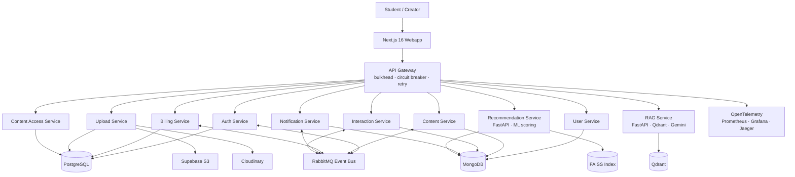

<div align="right">
  <a href="README.md"></a>
  <a href="README-vi.md"></a>
</div>

<div align="center">

# Buddy

### AI learning platform built as a production-grade microservices system

<p>
  <a href="#why-this-project-stands-out">Why it stands out</a> ·
  <a href="#architecture">Architecture</a> ·
  <a href="#engineering-highlights">Engineering</a> ·
  <a href="#run-locally">Run locally</a> ·
  <a href="#documentation">Docs</a>
</p>

<p>
  
  
  
  
  
</p>

<p>
  
  
  
  
  
</p>

<p>
  
  
  
  
  
  
</p>

</div>

---

## Snapshot

Buddy is a full-stack learning marketplace where creators publish video tutorials and resources, students buy or enroll in content, and an AI assistant answers questions from the actual course material.

It is intentionally built beyond CRUD: the system uses 11 deployable services, event-driven messaging, HLS media processing, payments, recommendations, RAG search, observability, and cloud deployment workflows.

| Area            | What is implemented                                                                              |
| --------------- | ------------------------------------------------------------------------------------------------ |
| **Platform**    | Course marketplace, creator profiles, library, follows, ratings, reviews, notifications          |
| **AI**          | RAG assistant with Qdrant retrieval, Gemini generation, Redis cache, citations, streaming UI     |
| **ML**          | TensorFlow two-tower recommendation model, FAISS indexing, drift monitoring, retraining triggers |
| **Media**       | FFmpeg HLS transcoding, trailer extraction, S3 presigned access, Cloudinary thumbnails           |
| **Reliability** | API gateway with bulkheads, circuit breakers, retries, and partial-failure composition           |
| **Money**       | Wallets, transactions, PayPal, PayOS, ownership records, subscriptions, payouts                  |

## Why This Project Stands Out

```txt
Recruiter scan:

  distributed systems        11 independently deployable services
  AI product engineering     RAG + recommendation model, not a thin chatbot wrapper
  production thinking        auth, billing, observability, queues, resilience, CI/CD
  frontend depth             ReactJS 19, Next.js 16, shadcn/ui, streaming assistant UX
  data depth                 MongoDB, PostgreSQL, Prisma, Mongoose, Redis, Qdrant
  deployment readiness       Docker Compose locally, Vercel + Fly.io/Azure in cloud
```

## Architecture



## Engineering Highlights

### Resilient Gateway

The API gateway protects downstream services with three defensive layers:

```txt
request -> bulkhead -> circuit breaker -> retry for idempotent reads -> service
```

| Pattern             | Purpose                                                                            |
| ------------------- | ---------------------------------------------------------------------------------- |
| **Bulkhead**        | Isolates service concurrency so one slow dependency cannot exhaust the gateway     |
| **Circuit breaker** | Fails fast after repeated downstream errors, then probes recovery                  |
| **Retry**           | Uses exponential backoff for safe `GET` requests only                              |
| **API composition** | Aggregates multi-service responses with `Promise.allSettled()` and partial results |

### AI Study Assistant

```txt
course material -> chunking -> embeddings -> Qdrant retrieval -> Gemini generation -> Redis cache -> streamed answer
```

- Answers are grounded in enrolled tutorials and uploaded resources.
- Retrieval uses semantic embeddings through `sentence-transformers`.
- Responses include source references back to the original learning material.
- The UI streams markdown responses in real time.

### Recommendation Engine

- Two-tower TensorFlow/Keras model separates user and item representations.
- Profile, behavior, and popularity signals are combined for ranking.
- FAISS powers fast nearest-neighbor lookup.
- Drift checks track out-of-vocabulary rates and trigger retraining when needed.
- RAG indexing and question answering run in the dedicated `rag-service`; recommendation-service focuses on scoring, trending, and model lifecycle.

### Media Pipeline

- Raw videos are converted to HLS `.m3u8` streams with FFmpeg workers.
- Tutorial trailers are extracted automatically from the first 15 seconds.
- Files are served through time-limited Supabase S3 presigned URLs.
- Cloudinary stores public thumbnails and preview assets.

## Tech Stack

| Layer                | Stack                                                                                                     |
| -------------------- | --------------------------------------------------------------------------------------------------------- |
| **Frontend**         | ReactJS 19, Next.js 16, TypeScript, Tailwind CSS v4, shadcn/ui, Radix UI, Base UI, Framer Motion, Spline  |
| **Client state**     | Redux Toolkit, React Redux, Redux Persist, Zustand, React Hook Form, Zod                                  |
| **Backend**          | NestJS 11, Fastify, TypeScript 5.4, CQRS, Clean Architecture, REST APIs                                   |
| **AI / ML**          | FastAPI, TensorFlow/Keras, Sentence Transformers, Qdrant, FAISS, Gemini, streaming RAG responses          |
| **Data**             | PostgreSQL, MongoDB, Redis, Prisma 7, Mongoose, Prisma Accelerate adapter                                 |
| **Messaging / Jobs** | RabbitMQ, BullMQ, event-driven workflows, background media processing                                     |
| **Storage / Media**  | Supabase S3, Cloudinary, FFmpeg, HLS `.m3u8` streaming, presigned URLs                                    |
| **Observability**    | OpenTelemetry, Prometheus, Grafana, Jaeger, service metrics and traces                                    |
| **Delivery**         | Docker, Docker Compose, Turborepo, GitHub Actions, Vercel, Fly.io, Azure Container Apps |

## Service Map

| Service                  | Port | Storage          | Responsibility                                |
| ------------------------ | ---: | ---------------- | --------------------------------------------- |
| `api-gateway`            | 3000 | -                | Reverse proxy, resilience, API composition    |
| `auth-service`           | 3001 | PostgreSQL       | Registration, login, JWT, refresh rotation    |
| `user-service`           | 3002 | MongoDB          | Profiles, follows, careers, skills, ratings   |
| `notification-service`   | 3003 | MongoDB          | Socket.io notifications and email events      |
| `content-service`        | 3004 | MongoDB          | Courses, tutorials, resources, collections    |
| `upload-service`         | 3005 | PostgreSQL       | Presigned uploads, HLS transcoding, trailers  |
| `billing-service`        | 3006 | PostgreSQL       | Wallets, payments, subscriptions, payouts     |
| `content-access-service` | 3007 | PostgreSQL       | Ownership checks and access grants            |
| `interaction-service`    | 3008 | MongoDB          | Views, saves, engagement tracking             |
| `recommendation-service` | 3009 | MongoDB + FAISS  | Recommendations, trending, ML scoring         |
| `rag-service`            | 3010 | MongoDB + Qdrant | RAG indexing, retrieval, AI answer generation |

## Monorepo Shape

```txt
buddy/
  services/
    api-gateway/
    auth-service/
    user-service/
    notification-service/
    content-service/
    upload-service/
    billing-service/
    content-access-service/
    interaction-service/
    recommendation-service/
    rag-service/
  webapp/
    src/app/
    src/features/
    src/components/
    src/lib/
  libs/
    common/
    contracts/
    testing/
  docs/
  docker-compose.yml
  turbo.json
```

## Run Locally

### Prerequisites

- Node.js `>=20 <23`
- npm `>=10`
- Docker and Docker Compose
- Python `3.10+`

### Start the platform

```bash
git clone https://github.com/khovan123/buddy.git
cd buddy
npm install

docker-compose up -d
npm run prisma:generate
npm run prisma:db:push
npm run dev
```

### Production-backed local run

Use this when you want to run the local app against the cloud-backed `.env.prod` configuration:

```bash
npm run dev:prod
```

For local parallel execution, `dev:prod` intentionally overrides container ports so every service can bind on one machine:

| Service                  | Local `dev:prod` port | Container `.env.prod` port |
| ------------------------ | --------------------: | -------------------------: |
| `api-gateway`            |                  3000 |                       8080 |
| `auth-service`           |                  3001 |                       8080 |
| `user-service`           |                  3002 |                       8080 |
| `notification-service`   |                  3003 |                       8080 |
| `content-service`        |                  3004 |                       8080 |
| `upload-service`         |                  3005 |                       8080 |
| `billing-service`        |                  3006 |                       8080 |
| `content-access-service` |                  3007 |                       8080 |
| `interaction-service`    |                  3008 |                       8080 |
| `recommendation-service` |                  3009 |                       8080 |
| `rag-service`            |                  3010 |                       8080 |
| `webapp`                 |                  8000 |                          - |

Local `dev:prod` also disables the upload BullMQ workers and the Python RabbitMQ consumers for `recommendation-service` and `rag-service`. This keeps the HTTP surfaces, model loading, MongoDB, Qdrant, and cloud-backed runtime paths testable without exhausting shared Redis Cloud or CloudAMQP connection limits.

For Fly.io, every service container binds to `PORT=8080` and `HOST=0.0.0.0`. The local `dev:prod` ports above are only for running all services on one development machine.

The deployed `rag-service` web process is memory-sensitive, so it lazy-loads embeddings on the first `/v1/rag/ask` or `/v1/rag/retrieve` request and disables startup warmup, bootstrap indexing, and the RabbitMQ content-sync consumer in the web machine. The HTTP health surface stays lightweight at `/v1/health/liveness`; catalog backfills and indexing can still be triggered through the gateway RAG proxy. For realtime RAG sync, run the consumer as a separate worker process instead of inside the public web process.

RAG citations returned to the Ask UI include `slug` and `itemId`. Source cards link directly to `/explore/resources/:slug` or `/explore/tutorials/:slug`, falling back to `:id` when the slug is unavailable, so clicking a card opens the actual content detail page instead of the listing page.

### Useful URLs

| Surface             | URL                             |
| ------------------- | ------------------------------- |
| Webapp              | http://localhost:8000           |
| API Gateway         | http://localhost:3000           |
| Recommendation API  | http://localhost:3009/v1/health |
| RAG API             | http://localhost:3010/v1/health |
| API Docs            | http://localhost:8000/api-docs  |
| Grafana             | http://localhost:3100           |
| Prometheus          | http://localhost:9090           |
| Jaeger              | http://localhost:16686          |
| RabbitMQ Management | http://localhost:15672          |
| Qdrant Dashboard    | http://localhost:6333/dashboard |

## Deployment

```txt
GitHub
  -> Vercel for webapp previews and production
  -> GitHub Actions for changed-service Docker builds
  -> Fly.io machines for service runtime
  -> Azure Container Registry / Azure Container Apps for supported service deployments
```

The backend workflow uses path-based filtering so only affected services are rebuilt and deployed on production pushes.

## Tradeoffs

| Strength                             | Cost                                                             |
| ------------------------------------ | ---------------------------------------------------------------- |
| Real distributed architecture        | Local setup requires multiple infrastructure services            |
| Event-driven workflows               | Debugging requires tracing and message visibility                |
| RAG + recommendations in one product | More moving parts than a standard marketplace                    |
| HLS processing pipeline              | Video jobs need worker capacity and storage lifecycle management |

## Documentation

| Document                                                                   | Description                                  |
| -------------------------------------------------------------------------- | -------------------------------------------- |
| [docs/SPEC.md](docs/SPEC.md)                                               | Technical specification and coding standards |
| [docs/deployment.md](docs/deployment.md)                                   | Vercel and Azure deployment guide            |
| [docs/api-gateway-architecture.MD](docs/api-gateway-architecture.MD)       | API gateway resilience design                |
| [docs/upload-service-architecture.md](docs/upload-service-architecture.md) | Upload and video processing architecture     |

## License

This project is private and not licensed for public distribution.

<div align="center">
  <sub>Built by <a href="https://github.com/khovan123">khovan123</a> · full-stack engineering, AI systems, and production architecture.</sub>
</div>
