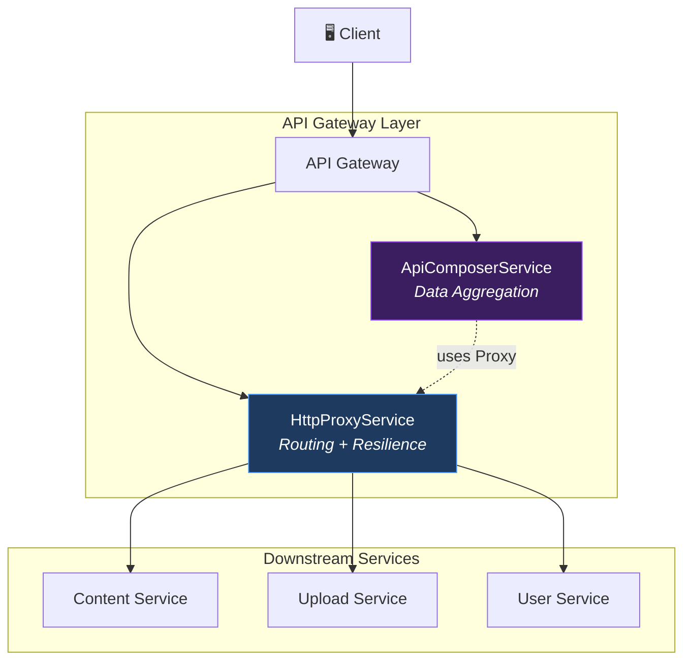
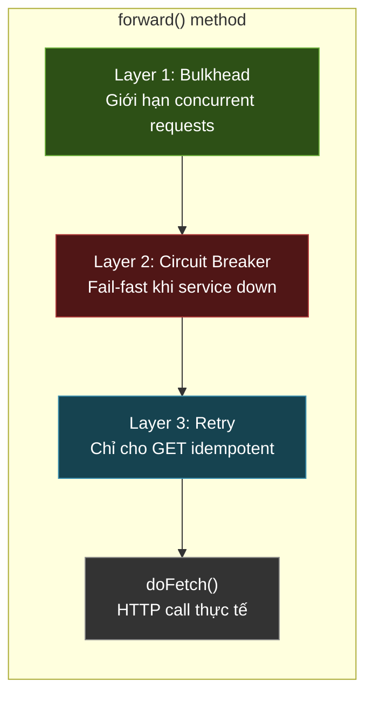
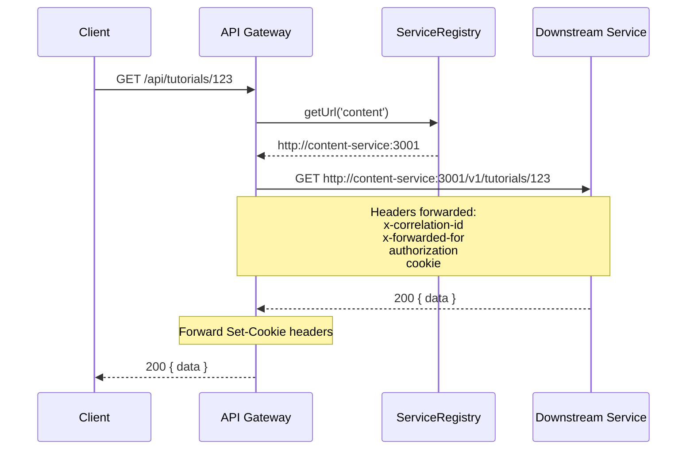
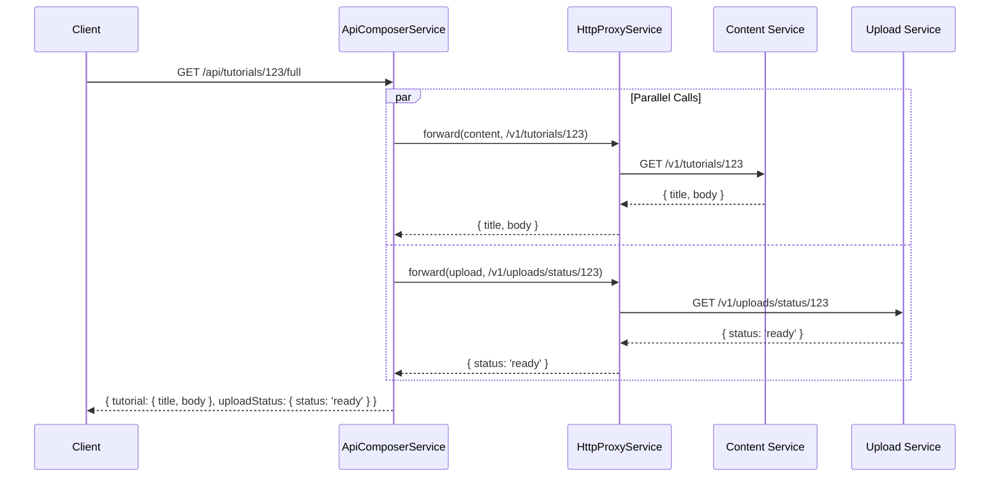
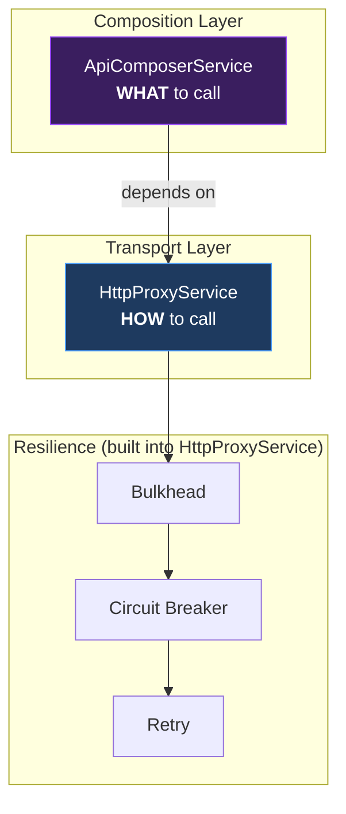

# API Gateway Services — Phân tích theo Microservices Patterns

## Tổng quan kiến trúc

Hai file này implement **2 pattern cốt lõi** của API Gateway trong kiến trúc microservices:



---

## 1. HttpProxyService — Reverse Proxy + Resilience Stack

📄 [http-proxy.service.ts](../services/api-gateway/src/infrastructure/http/http-proxy.service.ts)

### Pattern: API Gateway + Resilience Patterns

Service này đóng vai trò **reverse proxy** — nhận request từ client, forward đến downstream service tương ứng. Đây là implementation trực tiếp của **API Gateway Pattern** trong microservices.

### Resilience Stack (3 tầng bảo vệ)



#### Layer 1 — Bulkhead Pattern (Cách ly tài nguyên)

```typescript
// Mỗi service có giới hạn concurrent riêng
const DEFAULT_BULKHEAD = { maxConcurrent: 20, maxQueue: 50 };

// Upload service xử lý file lớn → giảm concurrency để tránh OOM
const BULKHEAD_OVERRIDES = {
  upload: { maxConcurrent: 10, maxQueue: 30 },
};
```

> [!IMPORTANT]
> **Tại sao cần Bulkhead?** Nếu Upload Service chậm và có 1000 request đổ vào, tất cả thread/connection pool của Gateway sẽ bị chiếm → các service khác (Content, User) cũng bị ảnh hưởng. Bulkhead **cách ly** từng service, giống như vách ngăn tàu thủy — 1 khoang bị ngập không làm chìm cả tàu.

#### Layer 2 — Circuit Breaker Pattern (Ngắt mạch)

```typescript
// Cấu hình per-service, có thể override qua env vars
breaker = new CircuitBreaker({
  name: `cb-${service}`,
  failureThreshold: config.get(`CB_FAILURE_THRESHOLD_${service}`) ?? 5,
  resetTimeoutMs: config.get(`CB_RESET_TIMEOUT_${service}`) ?? 30_000,
  halfOpenMaxAttempts: 2,
});
```

3 trạng thái:
| State | Hành vi |
|-------|---------|
| **CLOSED** | Hoạt động bình thường, đếm lỗi |
| **OPEN** | Từ chối mọi request ngay lập tức (fail-fast) sau 5 lỗi liên tiếp |
| **HALF-OPEN** | Sau 30s, cho thử 2 request. Thành công → CLOSED, thất bại → OPEN |

> [!TIP]
> Circuit Breaker ngăn chặn **cascade failure** — khi Content Service chết, Gateway không tiếp tục gửi hàng nghìn request vô ích, tránh làm quá tải network và kéo các service khác xuống theo.

#### Layer 3 — Retry with Exponential Backoff

```typescript
// Chỉ retry cho GET (idempotent) — POST/PUT/DELETE KHÔNG retry
if (isIdempotent) {
  return retry(() => this.doFetch(req, options, reply), {
    maxAttempts: 2,
    delayMs: 500,      // retry sau 500ms
    backoffFactor: 2,   // rồi 1000ms
  });
}
```

> [!WARNING]  
> **Tại sao không retry POST?** Vì POST không idempotent — retry có thể tạo duplicate order, charge tiền 2 lần, v.v. Chỉ GET an toàn để retry vì nó không thay đổi state.

### Request Forwarding (doFetch)



Các chi tiết quan trọng:
- **Correlation ID**: Propagate hoặc tạo mới → distributed tracing
- **Timeout**: 100s default, configurable per-request
- **Cookie forwarding**: Set-Cookie từ upstream → client (cho auth flows)
- **Error mapping**: Upstream error → `HttpException` với status code phù hợp (502 Bad Gateway, 504 Timeout)

---

## 2. ApiComposerService — API Composition Pattern

📄 [api-composer.service.ts](../services/api-gateway/src/infrastructure/http/api-composer.service.ts)

### Pattern: API Composition (Data Aggregation)

Trong microservices, data bị phân tán — để hiện 1 trang chi tiết tutorial, client cần gọi Content Service lấy nội dung + Upload Service lấy trạng thái video. **API Composition** gộp nhiều downstream call thành **1 response duy nhất**.



### Partial Failure Tolerance

Điểm hay nhất là dùng `Promise.allSettled()` thay vì `Promise.all()`:

```typescript
// Promise.all() → 1 call fail = TẤT CẢ fail ❌
// Promise.allSettled() → mỗi call được xử lý độc lập ✅

const results = await Promise.allSettled(
  requests.map((r) => this.proxy.forward(req, r.options))
);
```

Kết hợp với flag `optional`:

| Kịch bản | `optional: false` (default) | `optional: true` |
|-----------|----------------------------|-------------------|
| Call thành công | `composed[key] = data` | `composed[key] = data` |
| Call thất bại | **throw error** → toàn bộ compose fail | `composed[key] = null` + log warning |

### Ví dụ sử dụng thực tế

```typescript
// Trong controller:
const result = await this.composer.compose(req, [
  // BẮT BUỘC — fail nếu Content Service chết
  { 
    key: 'tutorial', 
    options: { service: 'content', path: '/v1/tutorials/123', method: 'GET' }
  },
  // TÙY CHỌN — trả null nếu Upload Service chết
  { 
    key: 'uploadStatus', 
    options: { service: 'upload', path: '/v1/uploads/status/123', method: 'GET' },
    optional: true 
  },
]);

// Result: { tutorial: {...}, uploadStatus: {...} | null }
```

> [!NOTE]
> `CompositionRequest` dùng `Omit<ProxyOptions, 'body'>` — chỉ cho phép **đọc dữ liệu** (GET), không cho phép ghi. Đây là đúng triết lý của API Composition: **chỉ aggregrate read, không orchestrate write** (write dùng Saga Pattern).

---

## Quan hệ giữa 2 Service



| | HttpProxyService | ApiComposerService |
|---|---|---|
| **Vai trò** | Transport + Resilience | Data Aggregation |
| **Pattern** | API Gateway, Circuit Breaker, Bulkhead, Retry | API Composition |
| **Quan hệ** | Độc lập, dùng trực tiếp từ controller | Phụ thuộc vào HttpProxyService |
| **Gọi bao nhiêu service?** | 1 service / lần gọi | N services song song |
| **Xử lý lỗi** | Throw exception | Partial failure tolerance |
| **Khi nào dùng?** | Forward đơn giản 1:1 | Cần gộp data từ nhiều services |

---

## Mapping với Microservices Patterns Playbook

| Pattern trong Playbook | Implementation |
|---|---|
| **API Gateway** | `HttpProxyService.forward()` — single entry point, routing |
| **Circuit Breaker** | Per-service `CircuitBreaker` instances với configurable thresholds |
| **Bulkhead** | Per-service `Bulkhead` instances với custom overrides |
| **Retry with Backoff** | Exponential backoff (500ms → 1s), chỉ cho idempotent operations |
| **API Composition** | `ApiComposerService.compose()` — parallel fetch + merge |
| **Service Registry** | `ServiceRegistryService` cung cấp URL cho downstream services |
| **Distributed Tracing** | Correlation ID propagation qua `x-correlation-id` header |
