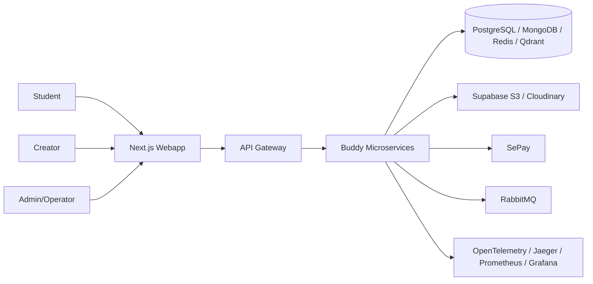
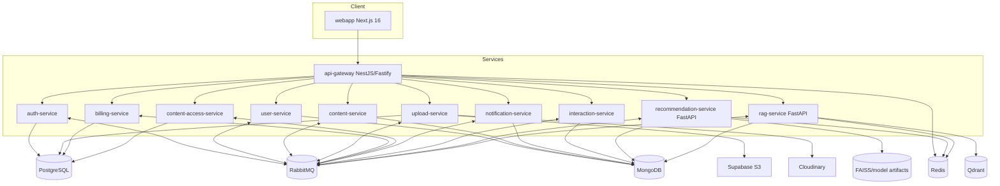
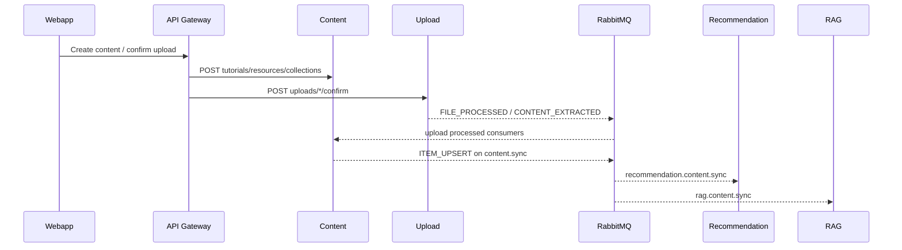
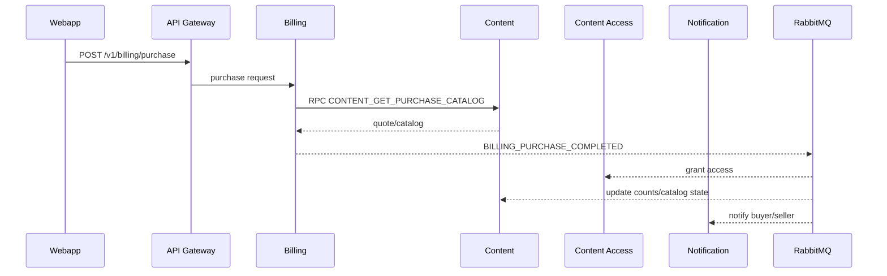

# Buddy - Architecture

## Architecture Summary

Buddy la monorepo microservices dung Turborepo. Frontend la Next.js webapp. Backend gom 9 NestJS services va 2 FastAPI AI services. `api-gateway` la public ingress chinh, proxy REST/WebSocket toi internal services va ap dung resilience patterns. Communication noi bo dung REST proxy + RabbitMQ events/RPC. Data duoc tach theo service ownership: PostgreSQL cho transactional domains, MongoDB cho document/catalog/social domains, Qdrant cho vector search, Redis cho cache/session/history.

## Context Diagram

## Container Diagram

## Service Interactions

- Webapp goi `api-gateway` qua `NEXT_PUBLIC_API_BASE_URL`/`NEXT_API_BASE_URL`.
- Gateway expose `/v1/*` REST va `/v1/forum/ws`, them `helmet`, CORS, validation, correlation id, exception filter.
- Gateway proxy auth/user/content/upload/billing/notification/interaction/recommendation/rag APIs.
- Content service dung RabbitMQ RPC toi upload-service de lay upload history/preview URL va toi user-service de enrich uploader.
- Billing service dung RabbitMQ RPC toi content-service de quote purchase catalog.
- Billing purchase emits events; content-access grant ownership/access; content/notification/update consumers xu ly side effects.
- Content sync emits fanout `content.sync`; recommendation-service va rag-service moi service co queue rieng de cap nhat catalog/index.

## Event Flows

## Database Ownership

| Database | Owner services | Notes |
| --- | --- | --- |
| PostgreSQL | `auth-service`, `upload-service`, `billing-service`, `content-access-service` | Moi service co Prisma schema rieng; khong nen query cross-service truc tiep |
| MongoDB | `user-service`, `content-service`, `notification-service`, `interaction-service` | Mongoose schemas va service-level collections |
| Redis | gateway/common, recommendation, rag, billing/upload cache | Cache/history/lock optional tuy service |
| Qdrant | `rag-service` | Vector index tu content chunks |
| FAISS/model artifacts | `recommendation-service` | Local/container artifact cho ANN va model versions |

## Security Model

- Auth: JWT access/refresh, refresh token rotation trong `auth-service`.
- Webapp: NextAuth session + token refresh logic, private route guard trong `webapp/src/proxy.ts`.
- Gateway: `helmet`, CORS required `ALLOWED_ORIGINS`, validation whitelist/forbid non-whitelisted, correlation id.
- Backend: Nest guards/decorators nhu `JwtAuthGuard`, policies/role access cho creator/admin routes o nhieu controller.
- Webhooks: gateway/register raw body parser, SePay headers duoc allow trong CORS; billing webhook route rieng.
- Deployment: active Cloud Run job deploy `api-gateway` unauthenticated, internal services `--no-allow-unauthenticated`.
- Risk: FastAPI admin/model endpoints can thiet lap IAM/internal network hoac gateway guard; direct public exposure se nguy hiem.

## Deployment Topology

Active CI/CD in `.github/workflows/ci.yml`:

- Detect changed services/webapp bang `dorny/paths-filter`.
- Backend test job chay lint, TypeScript type check, unit tests.
- Webapp job chay lint, `mfe:check`, type check, `npm test`.
- Active deploy job build Docker image len Google Artifact Registry va deploy Cloud Run region `asia-southeast1`.
- `api-gateway` public; services con lai private.
- Cloud Run settings trong CI: `--min-instances 1 --max-instances 1 --memory 1Gi --cpu 1`.

Local:

- `docker-compose.yml` chi start infrastructure: RabbitMQ, MongoDB, PostgreSQL, Redis, Qdrant, Prometheus, Grafana, Jaeger.
- `npm run dev:infra`, `npm run dev:db:push`, `npm run dev`.
- `docker-compose.prod.yml` la production-like local file nhung chua day du va co config sai, khong nen coi la source of truth.

## README Claims Validated Against Code

| README claim | Code status | Ghi chu |
| --- | --- | --- |
| 11 deployable services | Implemented | `services/*` co 11 package |
| Next.js/React webapp | Implemented | `webapp` Next app, App Router, feature folders |
| NestJS + FastAPI | Implemented | 9 NestJS, 2 FastAPI |
| PostgreSQL/MongoDB/Redis/RabbitMQ/Qdrant | Implemented | compose va service code |
| PayPal/PayOS | Stale/Missing | Code hien SePay, migration remove PayOS/PayPal |
| Fly.io/Azure deployment | Stale | Active CI deploy Google Cloud Run; Azure/Koyeb blocks commented |
| Prometheus/Grafana/Jaeger | Partial | compose infra co; CI/deploy observability production chua ro |
| HLS/FFmpeg/media processing | Implemented/Partial | upload workers/schema co; can test production path |
| RAG with citations | Implemented | RAG response sources, UI source cards |
| Recommendation ML model | Implemented/Partial | Rule fallback + model lifecycle; training quality operational risk |

## Scalability Concerns

- Cloud Run `max-instances 1` cho moi service la bottleneck va single-instance risk.
- RabbitMQ consumers va outbox co idempotency, nhung DLQ/replay runbook chua co.
- Recommendation/RAG cold start nang do model/embedding/Qdrant; da co warmup/bounded executor nhung can capacity planning.
- Gateway composition/coarse proxy co the thanh bottleneck neu khong scale rieng.
- MongoDB read models cho content/recommendation can indexes duoc validate bang query load.
- CI khong gate integration/e2e nen scale fixes co risk regression.

