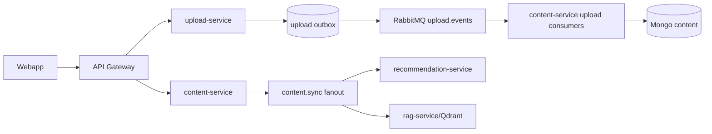
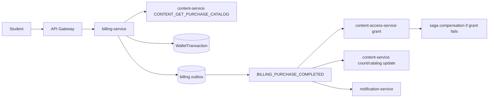
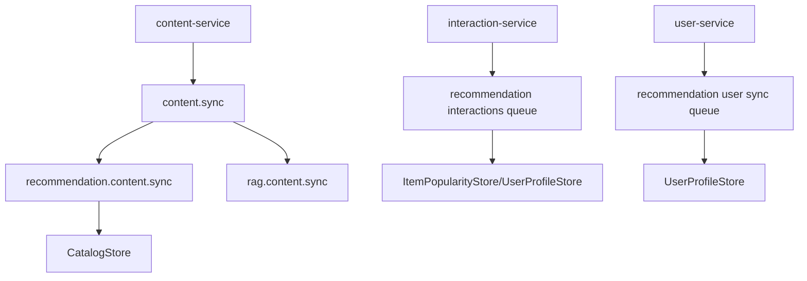

# Buddy - Event Flows

## Messaging Backbone

RabbitMQ la event/RPC backbone. Contracts nam trong `libs/contracts/src/events`. Common exchanges thay trong code:

| Exchange / Key family | Purpose |
| --- | --- |
| `auth.events` | auth user events |
| `user.events` | profile/user RPC/events |
| `upload.events` | upload processing, thumbnail, preview RPC |
| `content.events` | content validation, purchase catalog RPC, moderation |
| `billing.events` | purchase/subscription events |
| `notification.events` | notification commands/events |
| `content.sync` | fanout sync cho recommendation va RAG |
| `dead.letter` | DLX cho failed messages |

## Upload To Content Sync



Key events/routing keys:

- `FILE_PROCESSED`
- `FILE_PROCESSING_FAILED`
- `RESOURCE_UPLOAD_COMPLETED`
- `CONTENT_EXTRACTED`
- `THUMBNAIL_UPLOADED`
- `THUMBNAIL_UPLOAD_FAILED`
- Upload RPC keys for presigned URL/history/preview.

## Purchase Flow



Important rules:

- Purchase quote phai lay authoritative catalog/price tu content-service.
- Wallet transaction phai idempotent bang `idempotencyKey`/`externalRef`.
- Ownership/access grant phai idempotent bang unique constraints.
- Compensation/refund events ton tai trong `saga.events.ts`.

## Recommendation Sync



`recommendation-service` accepts:

- `ITEM_UPSERT`
- `ITEM_DELETED`
- user sync events
- interaction events with action weights.

## RAG Sync

```mermaid
flowchart LR
  Content[content-service ITEM_UPSERT] --> Fanout[content.sync]
  Fanout --> RAGConsumer[RAGContentConsumer]
  RAGConsumer --> Catalog[Mongo catalog read]
  Catalog --> Chunker[chunker]
  Chunker --> Embedder[sentence-transformers]
  Embedder --> Qdrant[(Qdrant)]
  Webapp --> Ask[/v1/rag/ask]
  Ask --> Retriever[Retriever]
  Retriever --> Generator[Gemini generator]
```

Notes:

- Heavy indexing duoc chay background.
- `/v1/rag/index` trigger full index.
- Startup co warmup/auto-index neu vector store rong.

## Notification Flow

- Billing purchase/subscription va recommendation model training co the publish notification events.
- `notification-service` luu notification/preference va expose `/v1/notifications`.
- Webapp hien notifications va settings panel.

## Event Consistency Risks

- DLQ/replay process chua duoc document hoa trong repo.
- Python consumers tu khai bao queues/exchanges; can dam bao naming khop Nest contracts.
- Outbox relay health/retry can monitoring rieng.
- At-least-once delivery yeu cau idempotency moi consumer; content co `ProcessedMessages`, cac service khac can audit tiep.

